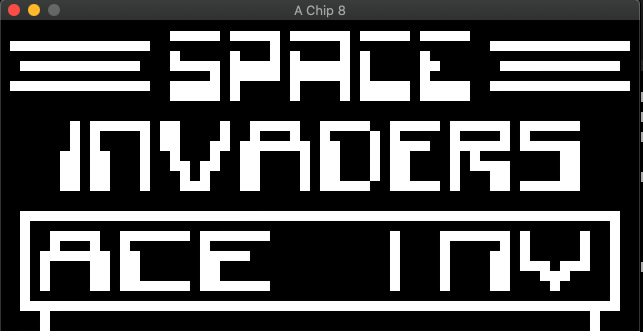
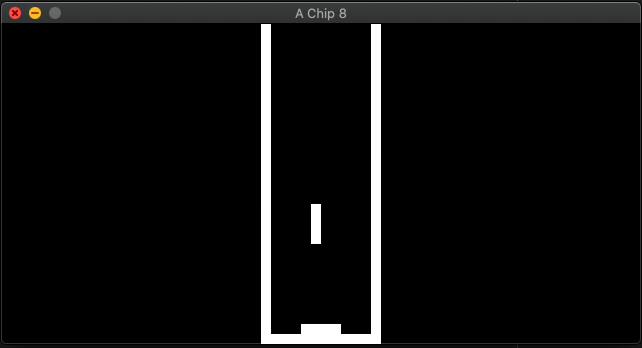

# a-chip-8

A chip-8 interpreter written in Go. 

## Screen Shots

### INVADERS


### TETRIS



## Requirements
* Go 1.14
* ebiten from Graphics. See [here](github.com/hajimehoshi/ebiten)
* beep for Sound. See [here](github.com/faiface/beep)

## ROMS
A list of public domain roms has been included with the project. Check the roms directory.

## Run and Build

Run the command 
```
make run file=roms/[file]
```
To run a rom, replace [file] with desired rom file

For build, run
```
make build
```
This will create a binary in /bin directory

Run the binary by running this command from root directory

```
./bin/chip8 roms/[file]
```

## Key Map

The original chip 8 keypad is arranged as follows

| | | | |
|-|-|-|-|
|1|2|3|C|
|4|5|6|D|
|7|8|9|E|
|A|B|C|F|

To make it suitable with modern keyboards, it was arranged as follows:

| | | | |
|-|-|-|-|
|1|2|3|4|
|Q|W|E|R|
|A|S|D|F|
|Z|X|C|V|

This would mean, when Q is pressed, the value 4 will be passed to the interpreter to simulate chip 8 keypad

## References:
* [Thomas P. Greene: Chip-8 Technical Reference](http://devernay.free.fr/hacks/chip8/C8TECH10.HTM#2.4)
* [Ayman Bagabas: Writing a Chip-8 emulator](https://aymanbagabas.com/2018/09/17/chip-8-emulator.html)
* [Matthew Mikolay: Mastering Chip-8](http://mattmik.com/files/chip8/mastering/chip8.html)